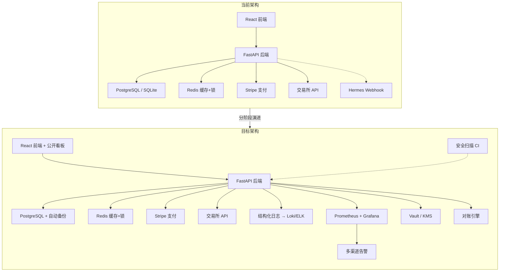

# Kenne Index 分阶段改进路线图

> **文档版本**: v1.0  
> **最后更新**: 2026-05-25  
> **适用范围**: Kenne Index 全平台（前端 + 后端 + 基础设施）

---

## 改进项总览表

| # | 阶段 | 改进项 | 风险等级 | 工作量 | 状态 |
|---|------|--------|---------|--------|------|
| 1 | P0 | 结构化 JSON 日志 + 日志脱敏 | 🔴 High | 2-3 天 | ✅ 已实现 |
| 2 | P0 | 数据库自动备份 | 🔴 High | 1-2 天 | ✅ 已实现 |
| 3 | P0 | 法律文档正式化 | 🔴 High | 2-3 天 | ✅ 已实现 |
| 4 | P0 | MFA disable step-up 修复 | 🔴 High | 0.5 天 | ✅ 已实现 |
| 5 | P0 | 依赖漏洞扫描 | 🟡 Medium | 0.5 天 | ✅ 已实现 |
| 6 | P1 | 多渠道告警系统 | 🔴 High | 3-5 天 | ✅ 已实现 |
| 7 | P1 | DCA 执行重试与订单状态机 | 🔴 High | 3-4 天 | ✅ 已实现 |
| 8 | P1 | 交易所余额对账 | 🟡 Medium | 2-3 天 | ✅ 已实现 |
| 9 | P1 | 可观测性基础设施 | 🟡 Medium | 3-5 天 | ✅ 已实现 |
| 10 | P1 | 自动化安全扫描 CI | 🟡 Medium | 1-2 天 | ✅ 已实现 |
| 11 | P2 | 公开 Kenne Index 看板 | 🟢 Low | 3-5 天 | ✅ 已实现 |
| 12 | P2 | 用户分享裂变系统 | 🟢 Low | 3-4 天 | ✅ 已实现 |
| 13 | P2 | KMS 密钥管理升级 | 🟡 Medium | 2-3 天 | ✅ 已实现 |
| 14 | P3 | SLA 与服务等级承诺 | 🟡 Medium | 2-3 天 | ❌ 未实现 |
| 15 | P3 | 多租户物理隔离 | 🟡 Medium | 5-10 天 | ⚠️ 预留 |

---

## 架构演进图

---

## 阶段一：P0 — 上线阻断项（1-2 周）

> [!CAUTION]
> 以下改进项如不完成即上线，将构成**安全漏洞**或**法律风险**。任何一项慢成都会导致用户资产损失或平台法律纠纷。

### 1.1 结构化 JSON 日志 + 日志脱敏

| 维度 | 详情 |
|------|------|
| **当前状态** | 使用 `logging.basicConfig()` 纯文本格式，`logger.error/exception` 可能在堆栈跟踪中泄露 API Key、数据库连接串等敏感信息 |
| **目标状态** | 全部日志输出为结构化 JSON 格式；所有敏感字段在日志中自动脱敏；生产环境日志可被 Loki/ELK 采集 |
| **实施方案** | 1. 替换 `logging.basicConfig` 为 `python-json-logger` 或 `structlog` 2. 创建 `backend/app/core/logging.py`，配置 JSON formatter 3. 编写 `SensitiveFilter`，对 `api_key`、`secret`、`password`、`token`、`cookie`、`authorization` 等字段自动掩码 4. 在 `main.py` 启动时加载新日志配置 5. 审查所有 `logger.error` / `logger.exception` 调用，确保不直接输出用户数据 |
| **工作量** | 2-3 天 |
| **风险等级** | 🔴 High — 日志泄露可导致 API Key 被盗用 |
| **依赖** | 无 |

### 1.2 数据库自动备份

| 维度 | 详情 |
|------|------|
| **当前状态** | Docker Compose 使用 `postgres_data` named volume，无自动备份。`SECURITY_RELEASE_CHECKLIST.md` 提到需配置但无实现 |
| **目标状态** | PostgreSQL 每日自动备份，至少保留 7 天，异地存储（S3/GCS），支持一键恢复 |
| **实施方案** | 1. 在 `docker-compose.yml` 中新增 `backup` 服务，使用 `prodrigestivill/postgres-backup-local` 或自定义脚本 2. 配置 cron 每日 UTC 03:00 执行 `pg_dump` 3. 使用 `rclone` 或 `aws s3 cp` 同步到对象存储 4. 编写恢复脚本 `scripts/restore_db.sh` 5. 验证备份恢复流程 |
| **工作量** | 1-2 天 |
| **风险等级** | 🔴 High — 数据丢失不可逆 |
| **依赖** | 需要对象存储账户（S3/GCS/R2） |

### 1.3 法律文档正式化

| 维度 | 详情 |
|------|------|
| **当前状态** | `TermsPage.tsx` 和 `PrivacyPage.tsx` 为模板占位符，明确标注"正式上线前请由法务审阅" |
| **目标状态** | 正式的服务条款、隐私政策、投资风险披露声明，经法务审阅后上线；注册流程必须勾选同意 |
| **实施方案** | 1. 基于本次生成的《用户服务协议》模板，委托法律顾问进行审阅和本地化 2. 更新 `TermsPage.tsx` 和 `PrivacyPage.tsx` 内容 3. 在 `LoginPage.tsx` 注册流程中添加强制勾选同意框 4. 在后端 `register` 接口增加 `accepted_terms: bool` 参数校验 5. 记录用户同意时间戳至 `User` 模型 |
| **工作量** | 2-3 天（技术实现） + 法务审阅时间 |
| **风险等级** | 🔴 High — 涉及实盘交易的 SaaS 无合规文档将面临法律风险 |
| **依赖** | 需要法律顾问 |

### 1.4 MFA disable step-up 修复

| 维度 | 详情 |
|------|------|
| **当前状态** | 启用 MFA 时需要验证码校验，但**禁用 MFA 时无需 step-up 验证**，攻击者获取会话后可直接关闭二次验证 |
| **目标状态** | 禁用 MFA 必须输入当前 TOTP 验证码或恢复码 |
| **实施方案** | 1. 修改 `backend/app/api/v1/security.py` 中 `disable_mfa` 路由 2. 添加 `StepUpCode` 依赖注入 3. 验证 TOTP code 后才允许禁用 4. 记录审计日志 |
| **工作量** | 0.5 天 |
| **风险等级** | 🔴 High — 安全降级操作无保护 |
| **依赖** | 无 |

### 1.5 依赖漏洞扫描

| 维度 | 详情 |
|------|------|
| **当前状态** | 无自动化漏洞检测，不清楚当前依赖是否存在已知 CVE |
| **目标状态** | 上线前完成一次全量扫描，确认无高危漏洞 |
| **实施方案** | 1. 后端：运行 `pip audit` 或 `safety check` 2. 前端：运行 `npm audit` 3. 修复所有 High / Critical 级别漏洞 4. 后续纳入 CI（见 P1-10） |
| **工作量** | 0.5 天 |
| **风险等级** | 🟡 Medium |
| **依赖** | 无 |

---

## 阶段二：P1 — 上线后首月改进（2-4 周）

> [!IMPORTANT]
> 以下改进项直接影响系统可靠性和用户信任度。上线后应在首月内优先完成。

### 1.6 多渠道告警系统

| 维度 | 详情 |
|------|------|
| **当前状态** | 仅有 Hermes Webhook（fire-and-forget），无直接推送到运维人员的告警渠道 |
| **目标状态** | 系统异常（DCA 执行失败、任务自动禁用、余额不足、API 限频、健康检查失败）时，通过 Telegram Bot / Discord Webhook / 邮件 推送告警 |
| **实施方案** | 1. 新增 `backend/app/service/alert_service.py` 2. 实现 `TelegramAlertChannel`、`DiscordAlertChannel`、`EmailAlertChannel` 3. 配置环境变量 `ALERT_TELEGRAM_BOT_TOKEN`、`ALERT_TELEGRAM_CHAT_ID`、`ALERT_DISCORD_WEBHOOK_URL` 4. 在 `task_service.py` 任务自动禁用时触发告警 5. 在 `dca_service.py` 执行失败时触发告警 6. 在 `risk_event_service.py` 高危事件时触发告警 7. 前端 `OpsPage.tsx` 增加告警通道配置 UI |
| **工作量** | 3-5 天 |
| **风险等级** | 🔴 High — 无告警等于"盲飞" |
| **依赖** | 需要 Telegram Bot / Discord 应用配置 |

### 1.7 DCA 执行重试与订单状态机

| 维度 | 详情 |
|------|------|
| **当前状态** | DCA 下单失败后直接记录 `failed` 状态，无重试。如果下单过程中断（网络超时），订单状态可能丢失 |
| **目标状态** | 引入订单状态机（`pending → sent → filled / failed`），网络超时自动重试（最多 2 次，指数退避），系统重启后自动回溯未决订单 |
| **实施方案** | 1. 在 `tenant_models.py` 中为交易记录增加 `order_status` 枚举字段 2. 修改 `dca_service.py` 下单流程：先写 `pending` → 调 API → 成功写 `filled` / 失败写 `failed` 3. 添加 `tenacity` 库实现指数退避重试（`@retry(stop=stop_after_attempt(3), wait=wait_exponential(min=1, max=10))`） 4. 在 `TaskRuntime` 启动时查询 `pending` 状态订单并尝试回溯 5. 重试仍失败的订单触发告警 |
| **工作量** | 3-4 天 |
| **风险等级** | 🔴 High — 涉及真金白银 |
| **依赖** | 依赖 1.6 告警系统 |

### 1.8 交易所余额对账

| 维度 | 详情 |
|------|------|
| **当前状态** | 无对账机制。用户在交易所的实际余额与系统记录可能不一致 |
| **目标状态** | 每日自动对账：拉取交易所余额快照，与系统内已记录的交易累计进行比对。差异超阈值时生成 `RiskEvent` 并告警 |
| **实施方案** | 1. 新增 `backend/app/service/reconciliation_service.py` 2. 新增 `BalanceSnapshot` 模型（`tenant_id, exchange, asset, remote_balance, local_balance, diff, created_at`） 3. 新增定时任务 `reconcile_balances`，每日 UTC 06:00 执行 4. 差异超过 1% 时生成 `RiskEvent` 并触发告警 5. 前端 `OpsPage.tsx` 增加对账结果展示 |
| **工作量** | 2-3 天 |
| **风险等级** | 🟡 Medium |
| **依赖** | 依赖 1.6 告警系统 |

### 1.9 可观测性基础设施

| 维度 | 详情 |
|------|------|
| **当前状态** | 已完成 Prometheus 集成和四大核心业务指标的定义与埋点 |
| **目标状态** | 已打通 API 请求监控、DCA 成功/失败统计、交易所 API 调用异常以及任务熔断事件监控 |
| **实施方案** | 1. 已改用 `prometheus-client` 直接导出指标，避免第三方 FastAPI 路由包装器与 Starlette 版本耦合 2. 已在 `main.py` 暴露 `/metrics` 接口 3. 已配置 `dca_executions_total`、`dca_amount_total`、`exchange_api_errors_total`、`task_failures_total` 四个核心业务指标并在相关逻辑中进行埋点 4. 已提供一键拉起的 `prometheus.yml` 配置并挂载至 `docker-compose.yml` 容器服务中 |
| **工作量** | 3-5 天 |
| **风险等级** | 🟡 Medium |
| **依赖** | 依赖 1.1 结构化日志 |

### 1.10 自动化安全扫描 CI

| 维度 | 详情 |
|------|------|
| **当前状态** | 无 CI/CD 流水线，无自动化安全检测 |
| **目标状态** | GitHub Actions CI 包含：依赖漏洞扫描、SAST（静态应用安全测试）、类型检查、lint、单元测试 |
| **实施方案** | 1. 创建 `.github/workflows/ci.yml` 2. 后端 job：`pip audit` + `bandit`（SAST）+ `mypy` + `ruff` + `pytest` 3. 前端 job：`npm audit` + `tsc --noEmit` + `eslint` + `vitest` 4. PR 必须通过 CI 才能合并 5. 设置 Dependabot 自动提交依赖更新 PR |
| **工作量** | 1-2 天 |
| **风险等级** | 🟡 Medium |
| **依赖** | 无 |

---

## 阶段三：P2 — 季度演进（1-3 个月）

> [!TIP]
> 以下改进项旨在增强产品竞争力和用户增长。虽不阻断上线，但直接影响商业成功。

### 2.1 公开 Kenne Index 看板（SEO 引流）

| 维度 | 详情 |
|------|------|
| **当前状态** | 所有数据仪表盘都在登录墙后面，无公开的市场指数页面 |
| **目标状态** | 创建公开的 `/market` 页面，展示 BTC/ETH 的 Kenne Index 实时值、历史走势、估值区间，作为免费"市场温度计"吸引搜索流量 |
| **实施方案** | 1. 新增 `backend/app/api/v1/public.py`，提供脱敏的公开信号数据 2. 新增 `frontend/src/pages/MarketPage.tsx`，展示 Kenne Index 实时看板 3. 添加 SEO meta tags、Open Graph、structured data 4. 在 `HomePage.tsx` 添加入口链接 5. 看板底部展示"解锁完整信号 → 注册"CTA |
| **工作量** | 3-5 天 |
| **风险等级** | 🟢 Low |
| **依赖** | 无 |
| **投资回报** | ⭐⭐⭐⭐⭐ — 最高 ROI 的增长手段，SEO 自然流量零成本 |

### 2.2 用户分享裂变系统

| 维度 | 详情 |
|------|------|
| **当前状态** | 无用户分享机制，产品价值无法被传播 |
| **目标状态** | 用户可生成精美的"定投表现卡片"（含 Kenne Index 走势、累计收益率、策略参数），以图片或链接形式分享到社交媒体。分享链接包含邀请码 |
| **实施方案** | 1. 新增 `backend/app/api/v1/share.py`，生成带邀请码的分享链接 2. 新增 `frontend/src/pages/ShareCardPage.tsx`，服务端渲染分享卡片 3. 使用 `html2canvas` 或 `@vercel/og` 生成图片 4. 邀请码关联推荐人，后续可做推荐奖励 5. 分享页面展示脱敏数据 + 注册 CTA |
| **工作量** | 3-4 天 |
| **风险等级** | 🟢 Low |
| **依赖** | 无 |
| **投资回报** | ⭐⭐⭐⭐ — 金融工具用户分享意愿高 |

### 2.3 KMS 密钥管理升级

| 维度 | 详情 |
|------|------|
| **当前状态** | `ENCRYPTION_KEY` 从环境变量直接读取，取前 32 字节生成 Fernet key。数据库泄露时，如果攻击者同时获取环境变量，则可解密所有 API Key |
| **目标状态** | 加密密钥通过独立的密钥管理服务（HashiCorp Vault / AWS KMS / GCP KMS）管理，应用运行时动态获取，不在环境变量中持久化 |
| **实施方案** | 1. 新增 `backend/app/core/kms.py`，抽象 `KeyProvider` 接口 2. 实现 `EnvKeyProvider`（现有兼容）、`VaultKeyProvider`、`CloudKmsKeyProvider` 3. 修改 `security.py` 中加密/解密函数使用 `KeyProvider` 4. 配置 `KMS_BACKEND` 环境变量切换实现 5. 生产环境部署 Vault 或使用云 KMS |
| **工作量** | 2-3 天 |
| **风险等级** | 🟡 Medium |
| **依赖** | 需要 Vault 或云 KMS 账户 |

---

## 阶段四：P3 — 长期愿景（3-6 个月）

> [!NOTE]
> 以下是构建产品护城河和企业级能力的长期投资。根据业务发展节奏灵活安排。

### 3.1 SLA 与服务等级承诺

| 维度 | 详情 |
|------|------|
| **当前状态** | 无正式的服务等级承诺，用户不清楚平台可用性保障 |
| **目标状态** | 发布正式 SLA 文档（Premium 用户 99.5% uptime），建立 Status Page（公开服务健康状态），承诺响应时间 |
| **实施方案** | 1. 部署开源 Status Page（如 `upptime` 或 `cachet`） 2. 配置 uptime 监控探针 3. 编写 SLA 文档，明确赔偿条款 4. 在 `BillingPage.tsx` 中展示 SLA 承诺 5. 集成历史可用性报表 |
| **工作量** | 2-3 天 |
| **风险等级** | 🟡 Medium |
| **依赖** | 依赖 1.9 可观测性基础设施 |

### 3.2 多租户物理隔离

| 维度 | 详情 |
|------|------|
| **当前状态** | 当前使用 `tenant_id` 行级隔离。已预留 `get_tenant_session()` 和 `_get_tenant_engine()` 接口，URL 模板 `kenne_tenant_{tenant_id}` |
| **目标状态** | 大客户支持独立数据库实例，实现物理隔离。普通用户继续使用共享库 |
| **实施方案** | 1. 实现 `get_tenant_engine()` 的实际连接池管理 2. 新增租户级数据库迁移脚本 3. 管理后台支持租户数据库配置 4. 租户数据导入/导出工具 |
| **工作量** | 5-10 天 |
| **风险等级** | 🟡 Medium |
| **依赖** | 依赖 1.2 数据库备份 |

### 3.3 高级回测引擎

| 维度 | 详情 |
|------|------|
| **当前状态** | 基础回测功能，支持 CSV 上传和服务器数据集 |
| **目标状态** | 支持多策略对比、Monte Carlo 模拟、滑点建模、手续费精确计算、可视化报告导出 |
| **实施方案** | 1. 扩展 `backtest_service.py` 支持多策略并行回测 2. 添加 Monte Carlo 随机模拟引擎 3. 引入滑点和手续费模型 4. 前端 `BacktestPage.tsx` 增加策略对比图表 5. 支持回测报告 PDF 导出 |
| **工作量** | 5-8 天 |
| **风险等级** | 🟢 Low |
| **依赖** | 无 |

### 3.4 移动端 PWA / 原生推送

| 维度 | 详情 |
|------|------|
| **当前状态** | 响应式 Web 应用，支持移动端浏览器访问 |
| **目标状态** | PWA 安装支持 + Web Push 通知，用户可将应用添加到主屏幕并接收 DCA 执行结果推送 |
| **实施方案** | 1. 添加 `manifest.json` 和 Service Worker 2. 集成 Web Push API 3. 后端新增推送订阅管理 4. DCA 执行完成后触发 Web Push |
| **工作量** | 3-5 天 |
| **风险等级** | 🟢 Low |
| **依赖** | 无 |

---

## 投资回报分析

按**用户增长**和**收入影响**评估各改进项的 ROI：

| 改进项 | 对用户增长的影响 | 对收入的影响 | ROI 评分 |
|--------|----------------|-------------|---------|
| 🏆 公开 Kenne Index 看板 | ⭐⭐⭐⭐⭐ 搜索流量入口 | ⭐⭐⭐ 漏斗顶部 | **最高** |
| 🥈 用户分享裂变 | ⭐⭐⭐⭐ 社交传播 | ⭐⭐⭐ 推荐转化 | **极高** |
| 🥉 多渠道告警 | ⭐⭐ 提升留存 | ⭐⭐⭐⭐ 减少客诉退款 | **高** |
| 法律文档正式化 | ⭐ 信任感 | ⭐⭐⭐⭐⭐ 消除法律风险 | **高** |
| DCA 重试 + 状态机 | ⭐⭐⭐ 核心体验 | ⭐⭐⭐⭐ 减少资金损失 | **高** |
| 可观测性 | ⭐ 间接 | ⭐⭐⭐ 减少故障影响 | **中** |
| KMS 升级 | ⭐ 间接 | ⭐⭐ 安全合规 | **中** |
| SLA | ⭐⭐ 企业客户 | ⭐⭐⭐ 高端定价 | **中** |
| 物理隔离 | ⭐ 企业客户 | ⭐⭐⭐ 企业定价 | **低** |

> [!TIP]
> **推荐优先级策略**：先完成 P0 安全项确保上线安全，然后同步推进**告警系统**（保命）和**公开看板**（增长），形成"安全 + 增长"双轮驱动。

---

## 技术债务清单

以下是当前代码中已识别的技术债务：

| # | 类型 | 位置 | 描述 | 影响 |
|---|------|------|------|------|
| 1 | 🔴 安全 | `backend/app/main.py` L43-48 | `logging.basicConfig` 纯文本日志，无脱敏过滤 | 日志泄露敏感数据 |
| 2 | 🔴 安全 | `backend/app/api/v1/security.py` | MFA disable 无 step-up 验证 | 会话劫持后可降级安全 |
| 3 | 🟡 可靠性 | `backend/app/service/dca_service.py` | 无交易所 API 调用重试 | 网络抖动导致下单失败 |
| 4 | 🟡 可靠性 | `backend/app/service/task_service.py` | 任务禁用后无主动告警 | 运维不知道任务已停止 |
| 5 | 🟡 架构 | `backend/app/core/security.py` L83-114 | `ENCRYPTION_KEY` 硬编码取前 32 字节 | 密钥管理不灵活 |
| 6 | 🟢 质量 | `frontend/src/pages/PricingPage.tsx` | 已删除，仅保留 `BillingPage` 作为订阅入口 | 已完成 |
| 7 | 🟢 质量 | `frontend/package.json` | 已移除未使用的 `framer-motion` 依赖 | 已完成 |
| 8 | 🟡 合规 | `frontend/src/pages/TermsPage.tsx` | 模板占位，标注"请法务审阅" | 法律风险 |
| 9 | 🟡 运维 | `docker-compose.yml` | 无数据库备份服务 | 数据丢失风险 |
| 10 | 🟢 质量 | `backend/app/core/database.py` | SQLite 开发 + PostgreSQL 生产双驱动 | ORM 行为可能不一致 |

---

## 实施建议

> [!IMPORTANT]
> **Sprint 规划建议**：
> 
> - **Sprint 1（第 1 周）**：完成 P0-1.1（日志）+ P0-1.4（MFA）+ P0-1.5（漏洞扫描）
> - **Sprint 2（第 2 周）**：完成 P0-1.2（备份）+ P0-1.3（法律）→ **可以上线**
> - **Sprint 3（第 3-4 周）**：P1-1.6（告警）+ P1-1.10（CI）+ P2-2.1（公开看板，开始）
> - **Sprint 4（第 5-6 周）**：P1-1.7（重试）+ P1-1.8（对账）+ P2-2.1（公开看板，完成）
> - **Sprint 5（第 7-8 周）**：P1-1.9（监控）+ P2-2.2（分享裂变）
> - **持续迭代**：P2-2.3（KMS）→ P3 各项

---

> **声明**：本路线图基于 2026-05-25 的代码审计结果编制。建议每季度重新评估优先级，根据业务指标和用户反馈动态调整。
