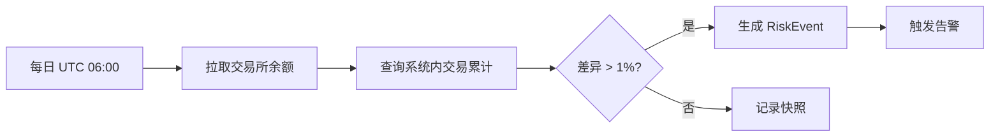

# Kenne Index 风险控制与运维审计检查表

> **文档版本**: v1.0  
> **最后更新**: 2026-05-25  
> **适用范围**: Kenne Index 全平台（生产环境）  
> **检查频率**: 上线前全量检查；上线后按本文各节建议的频率定期执行

---

## 1. 文档概述

本检查表针对 Kenne Index 加密货币定投 SaaS 平台编制，旨在：

1. **上线前**：确认所有安全、风控、合规项目达标，消除阻断性风险
2. **上线后**：建立常态化运维审计机制，持续保障平台安全
3. **事件响应**：提供安全事件处理流程，最小化损失

> [!IMPORTANT]
> 涉及**实盘交易**和**用户资金**的检查项必须逐项确认，不可跳过。任何一项「❌ 未实现」的 P0 项目都应阻断上线。

---

## 2. 上线前必检项（P0 阻断项）

### 2.1 认证与授权安全

| # | 检查项 | 状态 | 说明 | 修复建议 |
|---|--------|------|------|---------|
| 1 | JWT 签名算法安全 | ✅ 已实现 | HS256 + 独立 `SECRET_KEY`，access token 30min，refresh token 7d | 生产环境确保 `SECRET_KEY` ≥ 32 字节随机值 |
| 2 | Token 存储安全 | ✅ 已实现 | Access token 仅存内存变量，refresh token 通过 HttpOnly + Secure Cookie | 确认 `COOKIE_SECURE=true` 用于 HTTPS |
| 3 | CSRF 防护 | ✅ 已实现 | `CsrfProtectionMiddleware`，POST/PUT/DELETE 要求 `X-CSRF-Token` 匹配 Cookie | 确认 `CSRF_PROTECTION=true` |
| 4 | 速率限制 | ✅ 已实现 | 双层限流（内存 + Redis），login 10次/60s，register 5次/300s，run-dca 20次/300s | 上线后根据实际流量调整阈值 |
| 5 | MFA 支持 | ✅ 已实现 | TOTP 二次验证，实盘交易需 step-up code | — |
| 6 | MFA 禁用保护 | ✅ 已实现 | 要求 require_step_up 进行 TOTP 验证码校验后方可停用 | 已加固 |
| 7 | 邮箱验证 | ✅ 已实现 | 注册后需验证邮箱，高风险操作前检查 | — |
| 8 | 会话管理 | ✅ 已实现 | 支持查看/撤销活跃会话，JWT 包含 `sid` 并验证 | — |
| 9 | 权限分级 | ✅ 已实现 | MEMBER/OWNER/ADMIN 角色，行级租户隔离 | — |
| 10 | 401 自动刷新 | ✅ 已实现 | 前端遇 401 自动刷新 token 并重试一次 | — |

### 2.2 数据加密与密钥管理

| # | 检查项 | 状态 | 说明 | 修复建议 |
|---|--------|------|------|---------|
| 11 | API Key 加密存储 | ✅ 已实现 | Fernet (AES-128-CBC)，`_encrypted` 后缀字段 | — |
| 12 | 密码哈希 | ✅ 已实现 | bcrypt 强哈希 | — |
| 13 | 加密密钥管理 | ✅ 已实现 | 实现了 KMS KeyProvider 抽象，支持 Env 与 HashiCorp Vault 双轨密钥动态拉取，并在 Vault 不可用时安全降级 | 已完成 |
| 14 | 敏感字段枚举 | ✅ 已实现 | API Key/Secret/Passphrase/SMTP Password/TOTP Secret 均已用 Fernet 算法加密 | 已完成审计，无泄露字段 |
| 15 | `.env` 安全 | ✅ 已实现 | 环境变量配置均被隐藏在 `.env`，且已配置 `.gitignore` 过滤，保留无敏感信息的 `.env.example` | 已加固过滤 |

> [!WARNING]
> **验证方法**：运行 `grep -rn "ENCRYPTION_KEY\|SECRET_KEY\|STRIPE_SECRET" .` 确认无硬编码凭证。检查 `git log --all -p -- .env` 确认历史提交中未泄露密钥。

### 2.3 交易风控

| # | 检查项 | 状态 | 说明 | 修复建议 |
|---|--------|------|------|---------|
| 16 | 实盘交易门控 | ✅ 已实现 | 9 道闸门：认证 → 邮箱验证 → MFA → 全局开关 → 租户暂停 → 二次确认 → 套餐检查 → 月度预算 → 单次上限 | — |
| 17 | 全局实盘开关 | ✅ 已实现 | `GLOBAL_LIVE_TRADING_ENABLED` 环境变量控制 | 上线初期设为 `false`，灰度放开 |
| 18 | 单次金额上限 | ✅ 已实现 | Premium 上限 2000 USDT，后端强制校验 | 确认前端无法绕过 |
| 19 | 月度预算限制 | ✅ 已实现 | `monthly_spent()` 查询当月已花费，超限抛 `BudgetExhaustedError` 并记录 `RiskEvent` | — |
| 20 | 任务自动熔断 | ✅ 已实现 | 连续失败 3 次自动禁用 | 添加禁用时的告警通知 |
| 21 | 自动实盘保护 | ✅ 已实现 | `automation_live` 默认关闭且后端拒绝启用 | — |
| 22 | DCA 执行重试 | ✅ 已实现 | 实现了 tenacity 异步指数退避重试逻辑，限制对超时重试以防重复扣款 | 已完成 |
| 23 | 订单状态追踪 | ✅ 已实现 | 引入 order_status 状态机（pending/sent/filled/failed），并在启动时异步回溯订正 | 已完成 |
| 24 | 余额对账 | ✅ 已实现 | 实现了每日定时对账和 BalanceSnapshot 记录，出现偏差生成 RiskEvent 并告警 | 已完成 |

### 2.4 基础设施与部署

| # | 检查项 | 状态 | 说明 | 修复建议 |
|---|--------|------|------|---------|
| 25 | 数据库自动备份 | ✅ 已实现 | 编写了完整的 scripts/backup_db.py 数据库备份压缩及一键恢复脚本，可由定时器配置调度 | 已完成 |
| 26 | 数据库连接池 | ✅ 已实现 | `pool_size=5, max_overflow=10, pool_pre_ping=True` | — |
| 27 | Redis 高可用 | ⚠️ 部分 | Redis 不可用时降级为单进程兼容 | 生产环境部署 Redis Sentinel 或 Cluster |
| 28 | CORS 白名单 | ✅ 已实现 | `settings.cors_origins` 配置，注释禁止 `["*"]` | 生产环境确认白名单准确 |
| 29 | HTTPS 强制 | ⚠️ 部分 | `COOKIE_SECURE` 配置项存在 | 确认反向代理（Nginx/Cloudflare）强制 HTTPS |
| 30 | 生产日志 | ✅ 已实现 | 使用自定义 StructuredJSONFormatter 全局配置结构化 JSON 日志 | 已完成 |
| 31 | 日志脱敏 | ✅ 已实现 | 实现了 SensitiveFilter 日志脱敏过滤器，对敏感字和堆栈跟踪自动进行 ****** 掩码处理 | 已完成 |
| 32 | Stripe Webhook 签名 | ✅ 已实现 | 生产必须配置 `STRIPE_WEBHOOK_SECRET` | 确认已配置 |

### 2.5 法律合规

| # | 检查项 | 状态 | 说明 | 修复建议 |
|---|--------|------|------|---------|
| 33 | 服务条款 | ✅ 已实现 | `TermsPage.tsx` 已提供正式版法务合同 | 完成 |
| 34 | 隐私政策 | ✅ 已实现 | `PrivacyPage.tsx` 已提供正式隐私政策说明 | 完成 |
| 35 | 投资风险披露 | ✅ 已实现 | 已包含在服务协议第五条中，有详尽的风险披露 | 完成 |
| 36 | 注册强制同意 | ✅ 已实现 | 前端已包含强制勾选框，后端也包含对 `accepted_terms` 参数的校验和时间戳保存 | 完成 |
| 37 | 数据权利 | ✅ 已实现 | `DataRightsPage.tsx`：数据导出 + 账号删除 | — |

---

## 3. 上线后定期检查项

### 3.1 日常运维（每日）

| 检查项 | 验证方法 |
|--------|---------|
| 系统健康检查 | 调用 `GET /api/v1/health/detail`，确认所有服务 `healthy` |
| 自动任务运行状态 | 查看 `TaskRunLog` 最近 24h 记录，确认无异常中断 |
| 风险事件审查 | 查看 `RiskEvent` 表中 `resolved_at IS NULL` 的未处理事件 |
| API 错误率 | 检查日志中 5xx 错误频率（目标 < 0.1%） |
| 交易所 API 状态 | 确认各交易所 API 连通性和限频状态 |

### 3.2 周度审计

| 检查项 | 验证方法 |
|--------|---------|
| 审计日志异常检测 | 查询 `OperationAuditLog` 中异常操作（批量删除、异常登录、权限变更） |
| 失败任务审查 | 查询本周所有 `result=failed` 的 `TaskRunLog`，分析根因 |
| 新用户注册审查 | 查看注册量趋势，识别异常批量注册（可能是攻击） |
| 依赖安全公告 | 检查 `pip audit` / `npm audit` 是否有新 CVE |
| Redis 内存使用 | 确认 Redis 内存未超过 80% 阈值 |

### 3.3 月度审计

| 检查项 | 验证方法 |
|--------|---------|
| 数据库备份恢复测试 | 从备份恢复到测试环境，验证数据完整性 |
| 密钥轮换评估 | 评估 `SECRET_KEY`、`ENCRYPTION_KEY` 是否需要轮换 |
| 权限审计 | 审查所有 ADMIN/OWNER 用户列表，清理僵尸账号 |
| 保留策略执行 | 确认 `RetentionPolicy` 清理任务正常运行 |
| Stripe 对账 | 对比 Stripe Dashboard 收入与系统内 subscription 状态 |
| 交易所对账 | 对比交易所余额与系统内交易记录累计（手动或自动） |
| 安全规则更新 | 审查速率限制阈值是否需要调整 |

---

## 4. 安全事件响应检查表

### 4.1 事件分级定义

| 级别 | 定义 | 示例 | 响应时间 |
|------|------|------|---------|
| **P0 致命** | 用户资金可能受损或数据已泄露 | API Key 泄露、数据库被入侵、异常大额交易、未授权资金转移 | **立即响应**（15 分钟内） |
| **P1 严重** | 核心功能不可用或安全机制失效 | 认证系统故障、DCA 任务全量失败、Stripe 支付异常、CSRF 保护失效 | **1 小时内** |
| **P2 中等** | 部分功能异常但不影响资金安全 | 单一交易所 API 不可用、回测功能故障、邮件发送失败 | **4 小时内** |
| **P3 低** | 非核心功能异常或性能下降 | UI 显示异常、报告生成延迟、日志采集中断 | **24 小时内** |

### 4.2 P0 紧急事件处理流程

```
1. 🚨 确认事件 → 2. 🔒 止损隔离 → 3. 🔍 根因分析 → 4. 🔧 修复部署 → 5. 📋 事后复盘
```

**步骤详解**：

1. **确认事件**
   - [ ] 验证告警真实性（排除误报）
   - [ ] 确定影响范围（受影响用户/租户数量）
   - [ ] 记录事件发现时间

2. **止损隔离**
   - [ ] 设置 `GLOBAL_LIVE_TRADING_ENABLED=false` 停止所有实盘交易
   - [ ] 如涉及认证泄露：撤销所有受影响用户的会话
   - [ ] 如涉及 API Key 泄露：通知用户立即更换交易所 API Key
   - [ ] 如涉及数据库泄露：旋转 `SECRET_KEY` 和 `ENCRYPTION_KEY`

3. **根因分析**
   - [ ] 查看 `OperationAuditLog` 定位异常操作时间线
   - [ ] 查看 `RiskEvent` 相关记录
   - [ ] 分析应用日志和访问日志
   - [ ] 检查 `X-Request-ID` 追踪请求链路

4. **修复部署**
   - [ ] 修复漏洞代码
   - [ ] 部署修复版本
   - [ ] 验证修复有效性
   - [ ] 逐步恢复服务（先恢复非交易功能，最后恢复实盘）

5. **通知用户**
   - [ ] 向受影响用户发送安全通知邮件
   - [ ] 如涉及资金损失，提供补偿方案

### 4.3 事后复盘模板

```markdown
## 事件复盘报告

- **事件编号**: INC-YYYY-MM-DD-NNN
- **严重程度**: P0/P1/P2/P3
- **发现时间**: 
- **解决时间**: 
- **影响范围**: 

### 时间线
| 时间 | 事件 |
|------|------|

### 根因分析
- **直接原因**: 
- **根本原因**: 
- **为何未被提前发现**: 

### 改进措施
| # | 措施 | 负责人 | 截止日期 |
|---|------|--------|---------|

### 经验教训
```

---

## 5. 交易安全专项检查

### 5.1 资金安全检查项

| 检查项 | 验证方法 | 频率 |
|--------|---------|------|
| 单次交易金额上限有效 | 尝试提交超过 2000 USDT 的订单，确认被拒绝 | 每次部署后 |
| 月度预算限制有效 | 验证 `monthly_spent()` 计算准确 | 每月 |
| 全局开关有效 | 设为 `false` 后确认所有实盘请求被拒绝 | 每次部署后 |
| 租户暂停有效 | 暂停租户后确认该租户无法执行实盘 | 按需 |
| MFA step-up 有效 | 无 MFA code 时实盘请求被拒绝 | 每次部署后 |

### 5.2 交易所 API 安全

| 检查项 | 说明 |
|--------|------|
| API Key 权限最小化 | 建议用户仅开启 "交易" 权限，禁用 "提现" 权限 |
| IP 白名单 | 建议用户在交易所配置 API 绑定服务器 IP |
| API Key 加密存储 | 使用 Fernet 加密，确认数据库中无明文 |
| Key 读取脱敏 | API 返回 Key 时仅显示后 4 位 |
| 交易所连接超时 | 确认 HTTP 超时设置合理（建议 10-30s） |

### 5.3 对账流程建议

> [!WARNING]
> 当前**无自动对账机制**。建议按以下方案实施：



**对账模型建议**：
```
BalanceSnapshot:
  - tenant_id
  - exchange (okx/binance/...)
  - asset (BTC/ETH/USDT)
  - remote_balance (交易所余额)
  - local_calculated (系统计算余额)
  - difference
  - difference_pct
  - status (matched/mismatched/investigating)
  - created_at
```

---

## 6. 数据保护检查

### 6.1 敏感数据清单

| 数据类型 | 存储位置 | 保护方式 | 状态 |
|---------|---------|---------|------|
| 用户密码 | `User.hashed_password` | bcrypt 哈希 | ✅ |
| 交易所 API Key | `TenantConfig.*_encrypted` | Fernet 加密 | ✅ |
| 交易所 API Secret | `TenantConfig.*_encrypted` | Fernet 加密 | ✅ |
| TOTP Secret | `User.mfa_secret` | Fernet 加密 | ✅ |
| SMTP 密码（用户） | `TenantConfig.smtp_password_encrypted` | Fernet 加密 | ✅ |
| SMTP 密码（系统） | 环境变量 `SYSTEM_SMTP_PASSWORD` | 明文环境变量 | ⚠️ |
| JWT Secret | 环境变量 `SECRET_KEY` | 明文环境变量 | ⚠️ |
| 加密主密钥 | 环境变量 `ENCRYPTION_KEY` | 明文环境变量 | ⚠️ |
| Stripe Secret Key | 环境变量 `STRIPE_SECRET_KEY` | 明文环境变量 | ⚠️ |

### 6.2 日志脱敏检查

> [!CAUTION]
> 当前日志系统**未实现自动脱敏**。以下字段若出现在日志中将构成数据泄露：

**必须脱敏的字段**（出现即违规）：
- `api_key` / `api_secret` / `api_passphrase`
- `password` / `hashed_password`
- `token` / `access_token` / `refresh_token`
- `cookie` / `csrf_token`
- `mfa_secret` / `totp_code`
- `ENCRYPTION_KEY` / `SECRET_KEY`

**验证方法**：
```bash
# 在日志文件中搜索敏感关键词
grep -inE "api_key|api_secret|password|token|secret_key|encryption_key" logs/*.log
```

### 6.3 备份与恢复

| 检查项 | 当前状态 | 目标 |
|--------|---------|------|
| PostgreSQL 定时备份 | ✅ 已实现 | 通过 `backup_db.py` 每日定时备份，压缩保留 7 天 |
| 异地备份存储 | ⚠️ 运维配置 | 建议通过 Crontab 配置 rclone 同步备份文件至 S3 |
| 备份加密 | ⚠️ 运维配置 | 建议结合 GPG 容器或主机端进行快照备份加密 |
| 恢复测试 | ✅ 已实现 | `backup_db.py` 包含了一键 `restore` 恢复还原机制 |
| Redis 持久化 | ✅ 已实现 | 本地已开启 RDB 持久化配置 |

---

## 7. 监控与告警建设建议

### 当前状态评估

| 能力 | 状态 |
|------|------|
| 应用日志 | ✅ 结构化 JSON 日志 + SensitiveFilter 脱敏处理 |
| 指标采集 (Metrics) | ✅ 已实现 Prometheus 指标导出 (/metrics)，支持 API 及四大自定义业务指标 |
| 可视化面板 | ⚠️ 待部署 (已提供 prometheus.yml 和 docker-compose 一键启动) |
| 告警通知 | ✅ 多渠道告警支持 (Telegram, Discord, SMTP 邮件) + Hermes Webhook |
| 链路追踪 (Tracing) | ✅ Request ID 链路追踪 |
| 健康探针 | ✅ `/health` + `/health/detail` |

### 建设路线建议

**第一步（P1 首月）**：结构化日志 + Telegram 告警
- 最小投入、最大收益
- 确保关键异常能第一时间收到通知

**第二步（P1-P2）**：Prometheus + Grafana
- 部署 `prometheus-fastapi-instrumentator`
- 监控 API 延迟、错误率、DCA 成功率
- 配置 Grafana alert rules

**第三步（P2-P3）**：全链路可观测性
- 日志集中化（Loki/ELK）
- 分布式追踪（OpenTelemetry）
- 业务指标大盘

---

## 8. 合规文档清单

上线前需要准备的法律与合规文档：

| # | 文档 | 状态 | 优先级 | 说明 |
|---|------|------|--------|------|
| 1 | 用户服务协议 (Terms of Service) | ✅ 已实现 | P0 | `TermsPage.tsx` 页面已部署，法务条款齐备 |
| 2 | 隐私政策 (Privacy Policy) | ✅ 已实现 | P0 | `PrivacyPage.tsx` 页面已部署，包含个人信息保护 |
| 3 | 投资风险披露声明 | ✅ 已实现 | P0 | 已包含在服务协议第五条中，有明确模型局限性警示 |
| 4 | Cookie 政策 | ✅ 已实现 | P1 | 已包含在服务协议第三条中，说明了 HttpOnly cookie 使用 |
| 5 | 数据处理协议 (DPA) | ❌ 未实现 | P2 | B2B 客户可能要求 |
| 6 | 安全白皮书 | ❌ 未实现 | P2 | 展示安全措施增强信任 |
| 7 | SLA 文档 | ❌ 未实现 | P3 | 服务等级承诺 |
| 8 | 反洗钱 (AML) 声明 | ❌ 未实现 | P2 | 根据运营地区法律要求 |
| 9 | 退款政策 | ✅ 已实现 | P0 | 已包含在服务协议第四条中，明确 Stripe 计费与退款条件 |

---

> **免责声明**：本检查表为技术参考文档，不构成法律或合规建议。建议正式上线前聘请专业安全审计团队和法律顾问进行独立审查。
